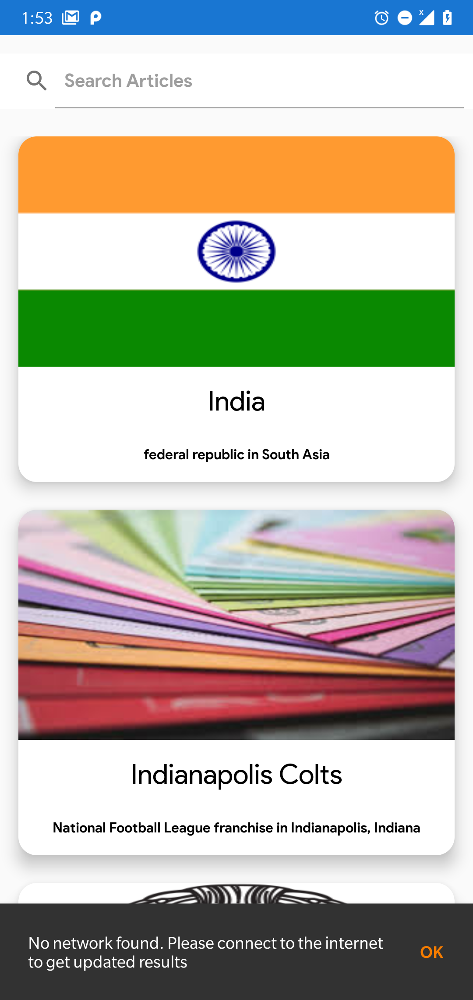
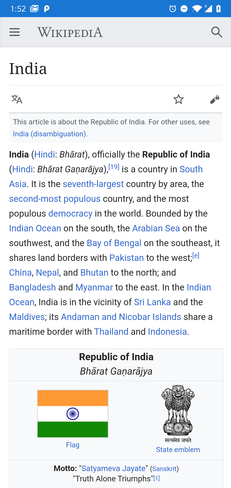

# Wikipedia-Api-Example
An android app which shows articles using Wikipedia API. It also allows the users to search for articles.

## I have used the following components to create this app:

1. MVVM as the application architecture
2. Retrofit for network calls
3. Room DB for offline storage
4. Dagger2 for dependency injection
5. RxJava and LiveData to observe responses and data
6. Picasso library to display images

## Application flow and screenshots:

### 1. Splash screen

### 2. Home screen

  #### a. Display articles
  
  Once splash screen activity is completed, the user will be on the home screen.
  First, the app will hit the below URL to fetch articles:
  
  https://en.wikipedia.org/w/api.php?action=query&format=json&prop=pageimages%7Cpageterms&generator=prefixsearch&redirects=1&formatversion=2&piprop=thumbnail&pithumbsize=300&pilimit=10&wbptterms=description&gpslimit=20
  
  It will fetch one of the random topics and display the results on the screen
  
  
  
  In case of no internet, the screen will look like below
  
  
  
  #### b. Search articles
  
  The user can also search for any article he/she wants. However, if there is no internet then the search option is disabled.
  
  
  
### 3. Article screen

Once the user clicks on any of the articles, he/she will be able to view the detailed article in the app.

In case the user is offline, a network unavailable page is show

